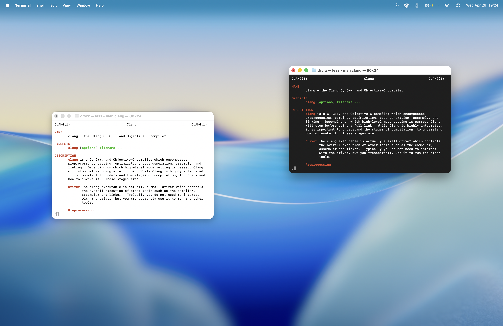

# Default macOS Tahoe dark mode terminal theme that is static.

1. Open **Terminal.app**
2. Open **Settings** `CMD + ,`
3. Click **(⋯)**
4. Import `Basic Dark.terminal`

## Preview
| Dark mode | Light mode |
|----------|------------|
|  |  |
